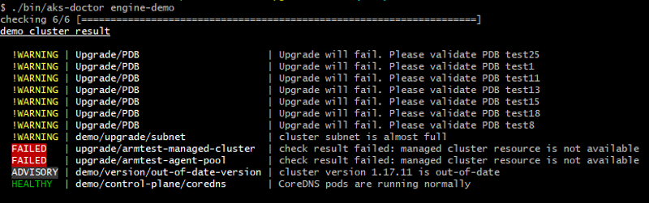

# AKS-Upgrade-Doctor
AKS Upgrade Doctor is a client side, self-help diagnostic tool designed to identify and detect possible issues that cause upgrade operations to fail on AKS clusters. 
This project was created as part of Microsoft's annual global hackathon and is currently in a <strong>beta</strong> state. 

# Goals
-Warn customers of incorrect Kubernetes cluster configurations before they try to perform an upgrade <br />
-Reduce number of clusters that get stuck in a failure state, resulting in a negative impact to the end customer <br />
-Allow for addition of new rule set via rules set engine <br />

# Scope 
This hackathon project focuses primarily on upgrade related issues although there is a protenial for the tool to evolve in the future.The first problem we are tackling is detection of restrictive PDBs configured on AKS clusters that cause upgrade operations to fail. Out of scope is the identification and detection of all other cluster issues.

# Implementation
Inspired by [kube-bench](https://github.com/aquasecurity/kube-bench), this project is implemented as a rule engine in Go lang and separates : ​

  -Definitions of the rules we need to check or detect <br />

  -Giving visual feedback of progress ​<br />

  -Structure and display of the results <br />

This implementation provides an extensible architecture which allows for the addition of further rules with minimal effort. Rule definitions can currently encompass anything that can be achieved with kubectl and [ARM API](https://docs.microsoft.com/en-us/rest/api/resources/) calls. 
​

# Future plans
Please refer back to this page for additional capabiltiies in the future.

# Usage 

```
# build 
$ make build
go build -o bin/aks-doctor ./aks/upgrade
# run 
$ ./bin/aks-doctor
Usage:
  aks-doctor [command]

Available Commands:
  completion  generate the autocompletion script for the specified shell
  demo        demo for pdb
  help        Help about any command

Flags:
  -h, --help   help for aks-doctor

Use "aks-doctor [command] --help" for more information about a command.

```

# Demo


